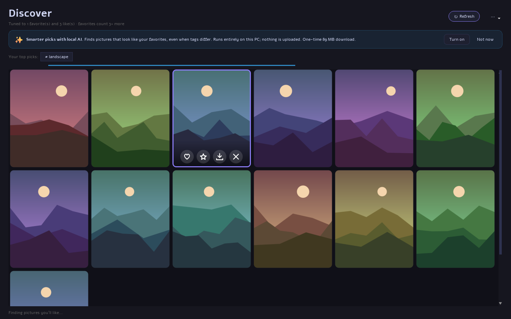

<p align="center"></p>

# Grabber Woo Edit

An all-in-one image searcher, downloader and personal picture Library. Search dozens of art sites at once, keep what you love, and get an endless **Discover** feed that learns from your likes and favorites.

[Download](https://github.com/SenjuWoo/imgbrd-grabber/releases/latest) · [Report an issue](https://github.com/SenjuWoo/imgbrd-grabber/issues) · [Upstream Grabber](https://github.com/Bionus/imgbrd-grabber) · [Apache 2.0 license](LICENSE)



*Discover with generated demo artwork. Pictures stay clean until you select one; then ♥ Like, ★ Favorite, Download and Not interested appear on it.*

## What's new in 7.18

- **Discover is the home page.** An endless, personal feed of *new* pictures from your selected sources. It searches with the real tags of what you like, favorites count three times as much as likes, recent ratings count a bit more, and every like, favorite or "Not interested" changes what comes next. Results stream in source by source and keep loading as you scroll.
- **Smart visual matching (optional local AI).** One click downloads an 89 MB image model; Discover then also ranks pictures that *look* like your favorites, even when tags differ. Everything runs on your PC, nothing is uploaded.
- **Your top picks.** Artists, characters and series you like most appear as chips at the top of Discover; one click opens a search.
- **A faster, cleaner Library.** One endless grid instead of pages, Select all, and a selection bar with Like, Favorite, Collection, **Download**, **Save to folder…**, Find source and Remove. **Download all** grabs every original in the current view. A new **Possible duplicates** view groups the same picture saved from different sources.
- **Search: Hide liked.** One checkbox hides pictures you already liked or favorited, including the same file from another site.
- **Merge results removes look-alike duplicates.** Besides identical checksums, merged results now recognise the same picture re-uploaded elsewhere (resized or recompressed). Strict thresholds keep edits, crops and recolors apart.
- **A modern shell.** A navigation rail (Discover, Search, Library, Following, Downloads, Monitors), search-only docks, the new **Woo Night** theme, rounded tiles that fill the window and toast confirmations. Keyboard: **L** like, **F** favorite, **D** download, **X** not interested, **Enter** open.
- **Ready-made defaults for new installs.** A curated set of sources and source presets, a blacklist, original-file downloads named by checksum, merged results and hidden blacklisted posts. Existing profiles keep all their settings.

## Discover

Open **Discover** (it is also where Grabber starts). Like ♥ or favorite ★ anything you enjoy — in Discover, search results, the viewer or Library — and the feed adapts:

- Queries come from your actual saved tags, weighted by how often and how strongly you rated them, and paired with tags that appear together in your favorites so searches stay specific. Overly common tags (like `1girl` or `highres`) are down-weighted.
- Each source's results are filtered (blacklist, already rated, already shown, hidden), de-duplicated by checksum and by appearance, ranked, and streamed in. Only the best share reaches the screen.
- **Not interested** (✕ or **X**) hides a picture for good and gently steers away from its tags. *⋯ → Show hidden pictures again* resets this.
- Choose **Everything I love** or a single collection's taste. Collections keep their own likes and favorites.
- With no ratings yet, Discover shows fresh posts from your sources until you rate a few.

Turn on **Smart visual matching** from the banner or *⋯*. The model is verified by size and SHA-256, the image index updates in the background, and Discover blends tag and visual similarity. Status and coverage are shown in the menu.

## Library


*Generated demo artwork imported from local files into a collection with its own likes and favorites.*

- **Like, Favorite and Collection** actions work in Discover, search thumbnails, the viewer, context menus and Library. Like and Favorite are exclusive per scope.
- **Collections have independent preferences.** A picture can belong to several collections, each with its own likes, favorites and notes.
- **Import existing downloads** by choosing files or folders, or dropping them on Library. Reference originals or keep managed copies; SHA-256 identifies exact duplicates.
- **Download / Save to folder.** Download fetches originals into your usual folder; Save to folder copies files already on disk and downloads the rest into a folder you pick.
- **Smart views:** Unsorted, Liked, Favorites, Recently saved, Needs tags, Needs source, Metadata errors and Possible duplicates.
- **Find or link a source** using recovered URLs, an exact MD5 query, or visual comparison against pictures already in Library.


Existing tag bookmarks remain available under **Following**, including monitors. Removing a Library entry or collection leaves original downloads on disk.

## Download and start

The primary release is a **portable Windows x64 ZIP** for Windows 10 or 11. Qt, OpenSSL, image plugins, SQLite, source scripts, themes, defaults and translations are bundled.

1. Download the Windows ZIP from [Releases](https://github.com/SenjuWoo/imgbrd-grabber/releases/latest).
2. Extract it into a writable folder and run `Grabber.exe`.
3. Pick a download folder in the first-launch window (or keep the recommended sources), then like a few pictures and open **Discover**.

For an existing portable install, close the app and back up its profile first. Preserve `settings.ini`, per-site settings/cookies, saved searches, history, blacklists, tabs, queues, `library.sqlite`, `library-media`, `discover.json`, `models/`, `recommendations/` and other personal files. Replace the runtime with a clean package instead of mixing Qt DLL generations. See [maintenance](docs/woo-maintenance.md).

The display name is **Grabber Woo Edit**. Executable names and profile identifiers are retained so updates never move or reset your data.

## Imported pictures and missing metadata

The Library grid shows every picture in one scrollable view; search and filters cover the entire Library.

- **Needs tags** lists pictures without usable tags. A successful import does not imply that tags were present in the file.
- **Needs source** lists pictures without an identified website post, including pictures whose file tags were recovered.
- **Metadata errors** lists reader failures separately from absent metadata. Open a picture's Overview for the reason.

Select one picture and click **Find source…** in the selection bar. Choose a source for exact MD5 lookup, or compare pictures already cached in Library, then confirm a candidate to attach its post metadata. **Import… → Recheck metadata** retries local files without duplicating pictures or resetting ratings. Likes, favorites, notes and collections work without tags and are kept when a source is linked. Optional [ExifTool](https://exiftool.org/install.html) extends EXIF/IPTC/XMP coverage.

## Online sources and current limits

The upstream downloader features remain: multiple tabs and sources, tag autocomplete, blacklists, filters, filename tokens, authentication, batch downloads, monitors and CLI commands. Sources include Danbooru, Gelbooru, Rule34, e621, Sankaku, Pixiv, Reddit, Kemono, Zerochan and more. Website availability and account requirements vary; some sites sit behind Cloudflare challenges or need API keys, and Discover reports sources that did not respond.

- **Pixiv** requires authentication. **Reddit** searches keywords, authors, subreddits and flair rather than booru tags.
- Discover searches the sources you selected in a search tab. Tag vocabularies differ between sites, so general tags are only searched on sites where you rated them; artists, characters and series can be searched anywhere.
- Visual matching compares previews against your own rated pictures. It does not perform Internet-wide reverse searches or upload files.

The Library stores its catalog and bounded previews locally. Fresh profiles have usage analytics disabled by default. Built-in backups include the catalog and managed copies; externally referenced originals need their own backup. Android uses a separate QML UI without these features.

## Build and verify

Use Qt 6, CMake, Ninja, Node.js, OpenSSL, and a C++17 compiler. Windows builds use MSVC. CI pins Qt **6.11.3**, Windows OpenSSL **3.5.9 LTS**, and the repository's exact source submodule revisions. The HTML parser is Lexbor **3.0.0**.

```powershell
# Windows: discover SDKs from QT_ROOT_DIR / OPENSSL_ROOT_DIR or the CMake cache.
powershell -NoProfile -ExecutionPolicy Bypass -File scripts/build-local.ps1
```

```sh
git submodule update --init --recursive
cd src/sites
npm ci
npm run build
npm run check
npm audit --audit-level=moderate
npm test -- --runInBand
```

`build-local.ps1` builds the GUI/CLI, runs the existing C++ and site tests, and stages a clean portable package with a commit and per-file hash manifest. Linux/macOS build instructions remain in the [upstream documentation](https://www.bionus.org/imgbrd-grabber/docs/compilation.html). The [Build workflow](.github/workflows/build.yml) checks Windows, Linux, macOS, Android, formatting, coverage, and site adapters. Published artifacts must come from the same commit whose required checks succeeded.

## Changes in 7.18.0

- Make **Discover** the home page: an endless personal feed from selected sources, learned from tag weights of likes (1×) and favorites (3×) with recency, co-occurring tag pairs, per-site vocabularies, persistent "Not interested" feedback, seen-history, blacklist and rating filters, checksum and visual de-duplication, per-source streaming and bounded timeouts.
- Use the local CLIP model where it helps: rank Discover candidates by visual similarity to rated pictures on a background thread. Add "Your top picks" chips and "More like this".
- Rebuild Library on a shared picture grid: no pages, Select all, selection bar, Download, Download all, Save to folder, Possible duplicates, in-place rating updates that keep scroll and selection.
- Search: add **Hide liked** and visual duplicate merging (including same-site reposts) to Merge results; hidden duplicates no longer leave gaps.
- Add the navigation rail, search-only docks, Woo Night theme, toasts and keyboard actions. Discover opens first unless Grabber was started for a specific search.
- Ship first-run defaults (sources, presets, blacklist, naming) for new profiles only; install every bundled theme.
- Fix the scroll range ending early on large grids by laying tiles out in a single pass.

## Changes in 7.17.1

- Add opt-in online Home discovery from existing selected sources, with scoped weighted tag topics, refresh rotation, bounded requests, cancellation, clear failures and explicit saving.
- Diversify local saved recommendations across interests while keeping collection preferences independent.
- Make Like and Favorite exclusive, including source merges and legacy catalog restoration; preserve a backup before correcting old overlapping ratings.
- Add image-only grids, shared density controls and Library page sizes; show actions after selecting a picture. Render cached/missing previews consistently, preserve aspect ratios, bound decoding and retry real thumbnail alternatives.
- Merge only exact checksums or identical full URLs without checksums; preserve edits, variants, uncertain matches and stable viewer bindings.
- Fix source-limit paging, estimated-total cutoffs, cursor isolation, batch progress, failed-source handling and truthful visible counts.
- Update the site test tooling's transitive Handlebars dependency to the security-patched 4.7.10 release.

## Changes in 7.16.0

- Add Home with local visual recommendations, independent collection taste, daily selection, recent saves, scoped hiding and shared image actions.
- Ship a verified CPU runtime; stream and verify the frozen CLIP model, index previews in a cancellable background job, and reuse vectors only for unchanged thumbnails/model identity.
- Preserve missing metadata labels and explain tagless ratings/index coverage. Keep explicit collection membership and viewer preference scope visible.
- Restore Home sessions and target the actual current search widget after tabs are moved. Finalize local AI work before destroying the profile on every application exit path.
- Add native UI, ranking, preprocessing/cache tests and real portable inference/reuse/corrupt-model CI checks.

## Changes in 7.15.4

- Rename the product to Grabber Woo Edit while preserving profile compatibility and historical attribution.
- Ship the desktop Library, collections, likes/favorites, scoped notes, covers, local imports, offline viewer, metadata recovery, and explicit source linking developed in the previous local milestones.
- Add a reference import command for automation: `Grabber-cli.exe --import-library "path/to/file-or-folder"`; it reuses the Library importer, preserves preferences, and reports errors as JSON.
- Add explicit gallery pagination, metadata review views, a visible source-link action, and safe metadata rechecks. Very large images remain in Library with metadata and ratings even when a preview cannot be decoded within the memory limit; use Open file to view their originals externally.
- Repair Reddit cursor pagination, author searches, empty subreddit listings, and crosspost media; handle Pixiv error and incomplete responses.
- Update Qt, Windows OpenSSL, Lexbor, and compatible Jest/ts-jest dependencies. Add the npm audit and Windows GUI test gates; use supported Node.js for source builds.
- Repair HTML document/selector ownership, release temporary serialization buffers, preserve UTF-8 byte lengths, and keep child nodes valid after their original wrapper closes.
- Distinguish failed update checks from an up-to-date result and retain legacy version comparisons.
- Repair fresh MSVC stable-build debug information; check generated flags before compiling.
- Deploy QScintilla's Qt PrintSupport dependency explicitly in portable Windows packages, including builds without the browser engine.
- Keep CLI initialization independent of the browser engine and test the extracted Windows package before uploading it.
- Keep prior download queue, bounded redirects/retries, save failure, ZIP validation, transactional database, conversion, theme, and translation repairs.

## Provenance

This fork is maintained in [SenjuWoo/imgbrd-grabber](https://github.com/SenjuWoo/imgbrd-grabber), based on [Grabber by Bionus and contributors](https://github.com/Bionus/imgbrd-grabber). It includes earlier Fable fork contributions and current upstream `develop` changes. The Apache 2.0 license and third-party notices remain intact. The screenshots show generated sample artwork, not a user's private Library.

Support the original author: [PayPal](https://www.paypal.me/jvasti) · [Patreon](https://www.patreon.com/bionus). Fork-specific bug reports belong in this repository; upstream contributions remain welcome.
