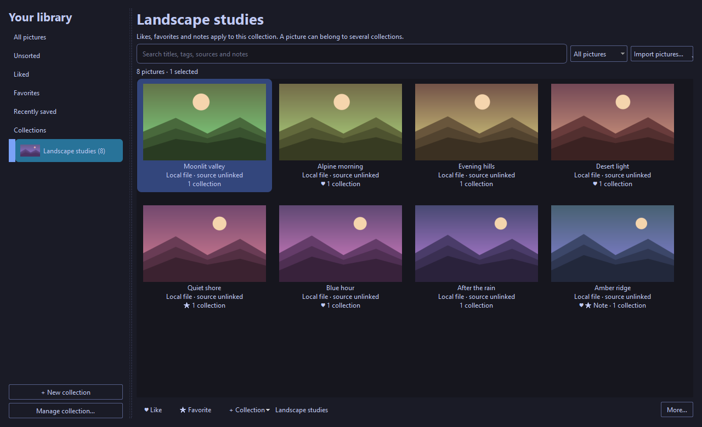
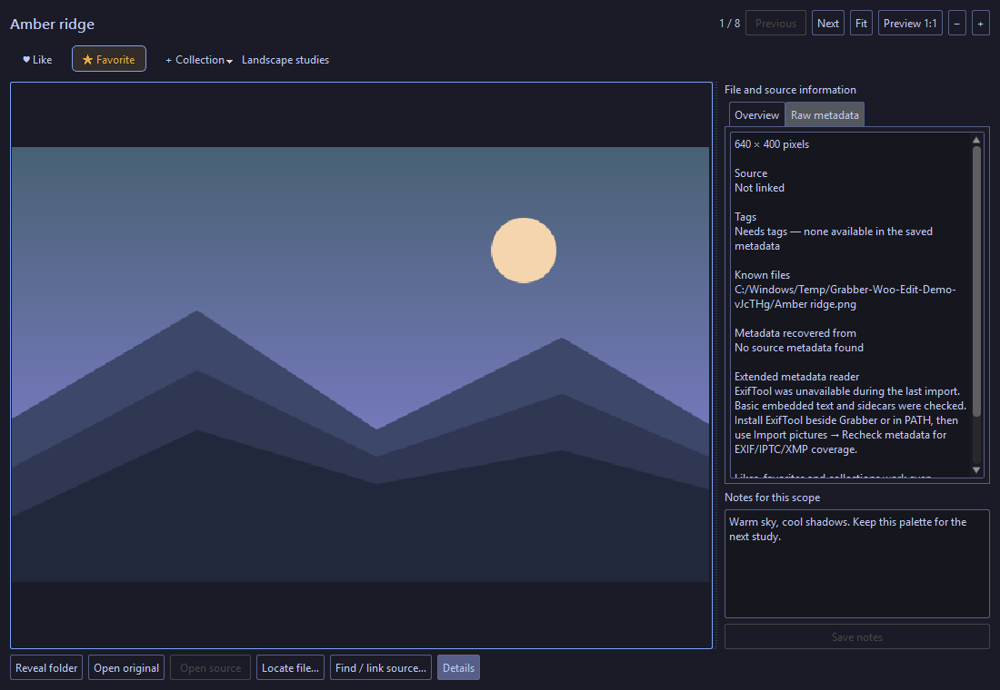

<p align="center"></p>

# Grabber Woo Edit

A desktop image downloader and personal picture Library for people who want to find, keep, and organize artwork across websites and their own folders.

[Download](https://github.com/SenjuWoo/imgbrd-grabber/releases/latest) · [Report an issue](https://github.com/SenjuWoo/imgbrd-grabber/issues) · [Upstream Grabber](https://github.com/Bionus/imgbrd-grabber) · [Apache 2.0 license](LICENSE)



*The real desktop Library with generated demo artwork imported from local files. The collection has its own likes, favorites, notes, and cover.*

## Keep pictures, not just searches

- **Like, Favorite, and Collection** actions work on search thumbnails, in the viewer, in context menus, and in Library. Favorites carry stronger preference weight than likes.
- **Collections have independent preferences.** A picture can belong to several collections, each with its own likes, favorites, and notes. Library-wide preferences remain separate.
- **Import existing downloads** by choosing files or folders, or dropping them into Library. Subfolders are included. Reference originals by default, or keep managed copies in the portable Library. SHA-256 identifies exact duplicates.
- **View local pictures offline** with zoom, pan, notes, and the same picture actions. Organize several pictures at once; give collections names and covers.
- **Recover available metadata** from embedded image text, adjacent JSON/XMP/tag files, Windows download-origin data, or optional ExifTool. Missing metadata stays unknown.
- **Find or link a source** using recovered URLs, an exact MD5 query on a configured site, or visual comparisons against online images already cached in Library. Review candidates before linking them.



*An imported file opens without rediscovering its online post. The inspector shows available metadata and collection notes.*

Existing tag bookmarks remain available as **Saved searches**, including monitors. Removing a Library entry or collection leaves original downloads on disk.

## Download and start

The primary release is a **portable Windows x64 ZIP** for Windows 10 or 11. Qt, OpenSSL, image plugins, SQLite, source scripts, themes, and translations are bundled. Build tools and Node.js are unnecessary to run it.

1. Download the Windows ZIP from [Releases](https://github.com/SenjuWoo/imgbrd-grabber/releases/latest).
2. Extract it into a writable folder and run `Grabber.exe`.
3. Use **Library → Import pictures…** for local downloads, or configure a website in **Sources** to search online.

For an existing portable install, close the app and back up its profile first. Preserve `settings.ini`, per-site settings/cookies, saved searches, history, blacklists, tabs, queues, `library.sqlite`, `library-media`, and other personal files. Replace the runtime with a clean package instead of mixing Qt DLL generations. See [maintenance](docs/woo-maintenance.md).

The display name is **Grabber Woo Edit**. The executable names and existing profile identifiers are retained so renaming the product does not move or reset your data. Historical Fable tags remain available in [Releases](https://github.com/SenjuWoo/imgbrd-grabber/releases).

## Imported pictures and missing metadata

The gallery shows 100 pictures per page, with **Previous page / Next page** and the current range. Search and filters cover the entire Library, including pictures on other pages.

- **Needs tags** lists pictures without usable tags. A successful picture import does not imply that tags were present in the downloaded file.
- **Needs source** lists pictures without an identified website post, including pictures whose file tags were recovered.
- **Metadata errors** lists reader failures separately from absent metadata. Open a picture's Overview for the reason.

Select one picture and click **Find / link source…** beside the rating buttons. Choose a source for exact MD5 lookup, or compare source pictures already cached in Library. Confirm a candidate to attach its post metadata. Similarity search does not search the whole Internet. **Import pictures… → Recheck metadata** retries local files without duplicating pictures or resetting ratings.

Likes, favorites, notes, and collection membership work without tags and are preserved when a source is linked. Recommendations are still planned. Missing tags will limit future tag-based matching; the stored preferences remain available for later enrichment. Basic embedded text and sidecars are checked automatically. Optional [ExifTool](https://exiftool.org/install.html) extends EXIF/IPTC/XMP coverage; the Overview reports when that reader was unavailable.

## Online sources and current limits

The upstream downloader features remain: multiple tabs and sources, tag autocomplete, blacklists, filters, filename tokens, authentication, downloads, and CLI commands. Sources include Danbooru, Gelbooru, Pixiv, Reddit, e621, Kemono, and others. Website availability and account requirements vary.

- **Pixiv already exists** and requires authentication. API errors are reported explicitly.
- **Reddit search uses keywords, authors, subreddits, and flair**, not booru tags. This fork removes irrelevant booru operators, follows Reddit cursors, and reports denied API access. Numbered page jumps are unavailable on that source.
- **Pinterest is not integrated.** AI recommendations, collection-guided discovery, author following, and a Home feed are planned; this release establishes the Library and preference data they need.
- Visual matching currently compares against cached Library images. It does not perform Internet-wide reverse searches or upload your files to an AI provider.

The Library stores its catalog and bounded previews locally. Fresh profiles have usage analytics disabled by default; an existing explicit preference is retained. Built-in backups include the catalog and managed copies. Externally referenced originals need their own backup.

The QWidget desktop UI contains the Library. Android uses a separate QML UI and does not yet contain this Library workflow. Cross-platform build checks do not establish live compatibility with every remote website. See [the backend audit](docs/woo-backend-audit.md) for evidence and limits.

## Build and verify

Use Qt 6, CMake, Ninja, Node.js, OpenSSL, and a C++17 compiler. Windows builds use MSVC. CI pins Qt **6.11.3**, Windows OpenSSL **3.5.9 LTS**, and the repository's exact source submodule revisions. The HTML parser is Lexbor **3.0.0**.

```powershell
# Windows: discover SDKs from QT_ROOT_DIR / OPENSSL_ROOT_DIR or the CMake cache.
powershell -NoProfile -ExecutionPolicy Bypass -File scripts/build-local.ps1
```

```sh
git submodule update --init --recursive
cd src/sites
npm ci
npm run build
npm run check
npm audit --audit-level=moderate
npm test -- --runInBand
```

`build-local.ps1` builds the GUI/CLI, runs the existing C++ and site tests, and stages a clean portable package with a commit and per-file hash manifest. Linux/macOS build instructions remain in the [upstream documentation](https://www.bionus.org/imgbrd-grabber/docs/compilation.html). The [Build workflow](.github/workflows/build.yml) checks Windows, Linux, macOS, Android, formatting, coverage, and site adapters. Published artifacts must come from the same commit whose required checks succeeded.

## Changes in 7.15.4

- Rename the product to Grabber Woo Edit while preserving profile compatibility and historical attribution.
- Ship the desktop Library, collections, likes/favorites, scoped notes, covers, local imports, offline viewer, metadata recovery, and explicit source linking developed in the previous local milestones.
- Add a reference import command for automation: `Grabber-cli.exe --import-library "path/to/file-or-folder"`; it reuses the Library importer, preserves preferences, and reports errors as JSON.
- Add explicit gallery pagination, metadata review views, a visible source-link action, and safe metadata rechecks. Very large images remain in Library with metadata and ratings even when a preview cannot be decoded within the memory limit; use Open file to view their originals externally.
- Repair Reddit cursor pagination, author searches, empty subreddit listings, and crosspost media; handle Pixiv error and incomplete responses.
- Update Qt, Windows OpenSSL, Lexbor, and compatible Jest/ts-jest dependencies. Add the npm audit and Windows GUI test gates; use supported Node.js for source builds.
- Repair HTML document/selector ownership, release temporary serialization buffers, preserve UTF-8 byte lengths, and keep child nodes valid after their original wrapper closes.
- Distinguish failed update checks from an up-to-date result and retain legacy version comparisons.
- Repair fresh MSVC stable-build debug information; check generated flags before compiling.
- Deploy QScintilla's Qt PrintSupport dependency explicitly in portable Windows packages, including builds without the browser engine.
- Keep CLI initialization independent of the browser engine and test the extracted Windows package before uploading it.
- Keep prior download queue, bounded redirects/retries, save failure, ZIP validation, transactional database, conversion, theme, and translation repairs.

## Provenance

This fork is maintained in [SenjuWoo/imgbrd-grabber](https://github.com/SenjuWoo/imgbrd-grabber), based on [Grabber by Bionus and contributors](https://github.com/Bionus/imgbrd-grabber). It includes earlier Fable fork contributions and current upstream `develop` changes. The Apache 2.0 license and third-party notices remain intact. The screenshots show generated sample artwork, not a user's private Library.

Support the original author: [PayPal](https://www.paypal.me/jvasti) · [Patreon](https://www.patreon.com/bionus). Fork-specific bug reports belong in this repository; upstream contributions remain welcome.
